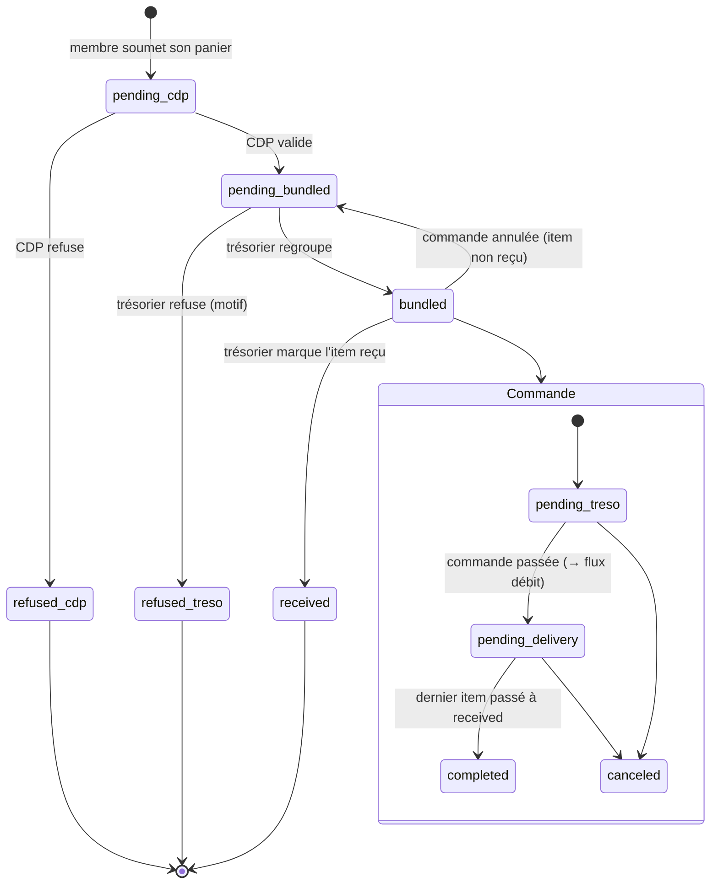

# Cahier des charges - Refonte des plateformes de commande et de trésorerie

## Conventions de lecture

Les exigences sont identifiées par un code stable pour permettre le suivi et la traçabilité :

- `CMD-*` : plateforme de commande
- `TRESO-*` : plateforme de trésorerie
- `TRANS-*` : exigences transverses (sécurité, performance, ergonomie, données)

Chaque exigence porte une priorité **MoSCoW** :

- **M** (Must) : indispensable à la première version utilisable à la rentrée
- **S** (Should) : important, à intégrer dès que possible après le socle
- **C** (Could) : confort, si le temps le permet
- **W** (Won't now) : noté pour plus tard, hors périmètre de la v1

Les blocs marqués **[Proposition]** ne sont pas des demandes issues des CR mais des choix de conception que je propose
pour combler les zones grises. Ils sont à arbitrer.

---

## 1. Contexte et objectifs

### 1.1 Contexte

L'association dispose aujourd'hui de deux outils internes : un site de commande de composants et un site de trésorerie.
Ces deux outils posent des problèmes de fiabilité (déconnexions, affichages aléatoires), de modèle (système de
permissions confus, données mal structurées) et d'ergonomie (statuts illisibles, historique peu exploitable). La
confiance dans l'outil actuel est insuffisante au point de ne pas vouloir y exposer la trésorerie tant que le socle
n'est pas sain.

L'activité se répartit sur deux campus, **Nantes** et **Paris**, ce qui impacte directement les adresses de livraison et
doit être visible sans ambiguïté.

### 1.2 Objectifs

1. Reconstruire un socle technique fiable (authentification, sessions, droits, persistance) en lequel on peut avoir
   confiance pour y porter la trésorerie.
2. Refondre le modèle de données autour du flux réel : les **membres ajoutent des items**, le **trésorier regroupe ces
   items en commandes**.
3. Rendre la gestion des commandes lisible et rapide (statuts clairs, distinction campus, budgets, historique utile).
4. Donner au trésorier un véritable outil de gestion financière (projets, partenariats, flux, justificatifs, documents,
   statistiques).
5. Repartir sur une base de données propre à la rentrée.

### 1.3 Périmètre

Deux plateformes (ou deux espaces d'une même application) partageant un socle commun (authentification, utilisateurs,
rôles, projets, partenaires) :

- **Plateforme de commande** : cycle de vie des items et des commandes, validation, livraison.
- **Plateforme de trésorerie** : projets, partenariats, flux financiers, justificatifs, documents et statistiques.

### 1.4 Échéance

Une première version saine et utilisable est attendue **pour la rentrée**, avec reprise sur base de données vierge.

---

## 2. Acteurs et rôles

| Acteur                   | Description             | Responsabilités principales                                                                     |
|--------------------------|-------------------------|-------------------------------------------------------------------------------------------------|
| **Membre**               | Membre d'un projet      | Propose des items (composants à acheter) rattachés à un projet                                  |
| **CDP** (chef de projet) | Responsable d'un projet | Revoit et valide les items proposés par les membres de son projet                               |
| **Trésorier**            | Gestion financière      | Regroupe les items validés en commandes, gère projets, partenariats, budgets et flux financiers |
| **Administrateur**       | Gestion de l'outil      | Gère les comptes, les rôles et la configuration                                                 |

> **[Tranché]** Le rôle n'est qu'un ensemble de permissions préconfiguré (voir §9). Un même utilisateur peut cumuler
> plusieurs casquettes (ex. membre d'un projet et CDP d'un autre). Le **campus** (Nantes / Paris) est porté à la fois
> par le membre et par le projet ; chaque item en dérive son campus de destination à sa création, et c'est le membre qui
> tranche si les deux divergent (§5.5).

---

## 3. Glossaire métier

| Terme                  | Définition                                                                                                                                                                                                                                                                                                                                                                                           |
|------------------------|------------------------------------------------------------------------------------------------------------------------------------------------------------------------------------------------------------------------------------------------------------------------------------------------------------------------------------------------------------------------------------------------------|
| **Item**               | Un composant à acheter : nom, lien, prix unitaire TTC, quantité, projet, et un **état** couvrant tout son cycle de vie — de la revue CDP jusqu'à la réception (§7.1). Créé par un membre. Porte son **campus de destination**, calculé à la création (§5.5).                                                                                                                                         |
| **Commande**           | Un regroupement d'items, généralement passé auprès d'un même fournisseur/partenaire, avec des frais de port. Créée par le trésorier. (possibilité de pré-regroupement en fonction des liens fournisseur)                                                                                                                                                                                             |
| **Projet**             | Une activité de l'association, à laquelle un membre rattache ses items. Chaque projet **désigne un budget** de l'arbre, à n'importe quelle profondeur (§6.1).                                                                                                                                                                                                                                        |
| **Budget**             | Une enveloppe de dépense, nœud d'un **arbre autonome** — l'arbre existe indépendamment des projets, qui viennent y pointer. Seules les **feuilles** portent un montant et reçoivent des imputations ; un nœud intermédiaire vaut la somme de ses descendants. Porte ses propres dates. À ne pas confondre avec le **compte** qui règle la dépense : imputation et paiement sont deux axes distincts. |
| **Partenaire (parte)** | Une entité avec laquelle l'association a un accord : remise, enveloppe de crédit ou don. Reconnue dans les liens par ses **domaines**. Seules les enveloppes sont modélisées, sous forme de compte (§6.2). À ne pas confondre avec le **fournisseur**, qui est simplement le marchand chez qui on achète et qui ne fait l'objet d'aucun référentiel en v1 (CMD-F-17).                                |
| **Flux financier**     | Une dépense (débit) ou une recette (crédit) de la trésorerie.                                                                                                                                                                                                                                                                                                                                        |
| **Année scolaire**     | Période de référence servant à délimiter et archiver commandes et flux.                                                                                                                                                                                                                                                                                                                              |
| **Frais de port**      | Coût d'expédition d'une commande, réparti entre les projets concernés.                                                                                                                                                                                                                                                                                                                               |

---

## 4. État des lieux — problèmes constatés à corriger

Synthèse des dysfonctionnements relevés. Ils constituent le point de départ des exigences des sections 5 à 10.

1. Les commandes ne s'affichent pas systématiquement (affichage non fiable).
2. Déconnexion pendant le traitement d'une commande, le tableau disparaît (gestion des tokens / sessions, cause non
   identifiée).
3. Déconnexions fréquentes en usage normal (gestion des tokens).
4. Système de permissions confus : mélange rôles / permissions, manque de confiance.
5. Impossible de modifier prix, quantités, noms et liens d'une commande.
6. Impossible de modifier une commande déjà passée.
7. Le drawer de modification s'ouvre en plusieurs exemplaires (il faut le fermer plusieurs fois), et les boutons de
   modification ne s'affichent pas.
8. À la validation, on ne peut pas modifier le prix de chaque composant un par un (unité ou total).
9. Tri des commandes basé sur la date de dernière mise à jour, peu pertinent.
10. Statuts de commande incohérents et non uniformes entre tables, filtres et affichage.
11. Aucune distinction visible entre Nantes et Paris (risque d'erreur d'adresse de livraison).
12. Historique peu utile (qui a modifié, mais pas quoi).
13. Prix ambigu : on ne sait pas si le montant affiché est unitaire ou total.
14. Cache à repenser.
15. Réinitialisation involontaire des champs quand on retire le dernier item dans `order/new`.

---

## 5. Exigences fonctionnelles — Plateforme de commande

### 5.1 Gestion des items (membres)

| ID       | Exigence                                                                                                                                                                                                                                                                                                                              | Prio |
|----------|---------------------------------------------------------------------------------------------------------------------------------------------------------------------------------------------------------------------------------------------------------------------------------------------------------------------------------------|------|
| CMD-F-01 | Un membre peut créer un item rattaché à un projet, avec : nom, lien, prix unitaire, quantité, tags (si plusieurs tags séléctionnés, demandé à choisir par article).                                                                                                                                                                   | M    |
| CMD-F-02 | Un membre peut modifier et supprimer ses items tant qu'ils ne sont pas rattachés à une commande passée et qu'ils n'ont pas été validé par le CDP.                                                                                                                                                                                     | M    |
| CMD-F-03 | Dans le formulaire de création/édition, le retrait du dernier item doit réinitialiser sa ligne.                                                                                                                                                                                                                                       | S    |
| CMD-F-09 | La saisie se fait via un **panier multi-lignes** : le membre choisit un projet, ajoute N lignes et soumet le tout en une fois. Le panier est un écran de saisie, **pas une entité** : chaque ligne est persistée comme un item indépendant, et la vue « mes items » liste des items, pas des paniers.                                 | M    |
| CMD-F-04 | La sélection de plusieurs tags se fait facilement (cases à cocher / multi-sélection).                                                                                                                                                                                                                                                 | C    |
| CMD-F-05 | Un message recommande aux membres de passer en priorité par les partenaires de l'association.                                                                                                                                                                                                                                         | S    |
| CMD-F-06 | Un indicateur signale au membre, au moment de la saisie, un dépassement du budget du projet concerné.                                                                                                                                                                                                                                 | S    |
| CMD-F-07 | Lors des commandes, proposer des composants des sites partenaires ou potentiellement moins chères avec avertissements.                                                                                                                                                                                                                | W    |
| CMD-F-08 | Pouvoir lier des fichiers aux items (kicad, excel mouser, ...)                                                                                                                                                                                                                                                                        | C    |
| CMD-F-0A | Persistance des paniers en brouillon (le membre quitte et retrouve sa saisie en cours).                                                                                                                                                                                                                                               | W    |
| CMD-F-0B | Un item porte une **note libre** saisie par le membre (référence exacte, urgence, variante acceptable). C'est aussi par elle que passe une demande de **livraison à une autre adresse** que celle du campus (§5.5). La note est visible du CDP à la revue et du trésorier au regroupement, sans avoir à déplier un panneau de détail. | M    |

### 5.2 Constitution des commandes (trésorier)

| ID       | Exigence                                                                                                                                                                                                                                                                                                                    | Prio |
|----------|-----------------------------------------------------------------------------------------------------------------------------------------------------------------------------------------------------------------------------------------------------------------------------------------------------------------------------|------|
| CMD-F-10 | Le trésorier regroupe des items (validés) en une commande, par sélection multiple (cases à cocher).                                                                                                                                                                                                                         | M    |
| CMD-F-11 | Une commande porte un ou plusieurs items pouvant relever de projets différents.                                                                                                                                                                                                                                             | M    |
| CMD-F-12 | Les frais de port d'une commande sont répartis entre les projets concernés selon une règle définie (voir §7.3).                                                                                                                                                                                                             | M    |
| CMD-F-13 | Le trésorier peut indiquer un délai de livraison estimé par article.                                                                                                                                                                                                                                                        | W    |
| CMD-F-14 | Une commande porte un **nom de fournisseur libre** (`supplier_name`) et, si ce fournisseur est référencé, une **liaison optionnelle vers un partenaire** (`partner_id`). Aucun référentiel n'est imposé pour commander.                                                                                                     | M    |
| CMD-F-15 | Pré-regroupement automatique des items par fournisseur, déduit du domaine de leur lien.                                                                                                                                                                                                                                     | C    |
| CMD-F-16 | Chaque item porte un **domaine** déduit de son lien (`mouser.fr`), stocké à la saisie. C'est lui qui sert au pré-regroupement (CMD-F-15), à la reconnaissance des partenariats (TRESO-F-12) et aux **statistiques par marchand** — aucun référentiel de fournisseurs n'est nécessaire pour cela.                            | C    |
| CMD-F-17 | Constituer un **référentiel de fournisseurs** (fiche marchand rattachant ses domaines, son partenariat éventuel et ses commandes) pour produire des **statistiques par fournisseur** : volume d'achat, dépense par année scolaire, délais, part des partenaires.                                                            | W    |
| CMD-F-18 | Au moment de constituer la commande, le trésorier choisit **pour chaque item** le budget sur lequel il est imputé. La **feuille par défaut du budget visé par le projet de l'item est présélectionnée** (TRESO-F-02c) ; seuls les budgets feuilles actifs à la date de la commande sont proposés (TRESO-F-02b, TRESO-F-07). | M    |
| CMD-F-19 | Un item peut être **réparti sur plusieurs budgets**, chacun recevant une part du montant. La somme des parts égale toujours le total de l'item.                                                                                                                                                                             | M    |

### 5.3 Cycle de vie et statuts

| ID       | Exigence                                                                                                                                                                                                                                                                                                                                                                                    | Prio |
|----------|---------------------------------------------------------------------------------------------------------------------------------------------------------------------------------------------------------------------------------------------------------------------------------------------------------------------------------------------------------------------------------------------|------|
| CMD-F-20 | Les statuts sont un ensemble **fermé et unique**, identique dans les tables, les filtres et l'affichage détail.                                                                                                                                                                                                                                                                             | M    |
| CMD-F-21 | Statuts d'**item** : **En revue par le CDP** (`pending_cdp`) → **Validé** (`pending_bundled`) → **Regroupé** (`bundled`) → **Reçu** (`received`), plus deux refus terminaux : **Refusé par le CDP** (`refused_cdp`) et **Refusé par le trésorier** (`refused_treso`). Statuts de **commande** : **En attente du trésorier** → **En attente de livraison** → **Terminée**, plus **Annulée**. | M    |
| CMD-F-22 | Chaque statut dispose d'un repère visuel (badge coloré et/ou emoji) dans toutes les tables.                                                                                                                                                                                                                                                                                                 | M    |
| CMD-F-23 | Les transitions de statut sont contrôlées par les permissions (voir §8 et §9).                                                                                                                                                                                                                                                                                                              | M    |
| CMD-F-24 | Si une commande qui pendant plus d'un mois est "en attente de livraison", un mail est envoyé à la tréso avec un bouton pour valider en un clic.                                                                                                                                                                                                                                             | C    |
| CMD-F-25 | Le trésorier peut marquer **item par item** sa réception, ce qui autorise les **réceptions partielles** : une commande peut contenir simultanément des items `bundled` et des items `received`.                                                                                                                                                                                             | M    |
| CMD-F-26 | Une commande passe à **Terminée** lorsque **tous** ses items sont `received` ; tant qu'il en reste au moins un en `bundled`, elle demeure **En attente de livraison**.                                                                                                                                                                                                                      | M    |
| CMD-F-27 | Le détail d'une commande affiche l'avancement de la réception (ex. « 7 / 12 reçus »), et la liste des commandes le signale sur la ligne.                                                                                                                                                                                                                                                    | S    |
| CMD-F-28 | Le membre voit passer ses propres items à **Reçu** sans avoir à consulter la commande qui les porte.                                                                                                                                                                                                                                                                                        | S    |
| CMD-F-29 | Le trésorier peut **refuser** un item validé par le CDP (`pending_bundled → refused_treso`), avec motif obligatoire. Le refus est terminal et distinct de celui du CDP : l'auteur du refus se lit dans l'état lui-même.                                                                                                                                                                     | M    |
| CMD-F-2A | Un item **regroupé** ne se refuse pas directement : il faut d'abord annuler la commande qui le porte, ce qui le ramène à **Validé** où le refus redevient possible. Un item **reçu** ne se refuse jamais.                                                                                                                                                                                   | M    |

> **[Tranché]** La **revue du CDP porte sur les items**, pas sur la commande. Un item passe de _En revue par le CDP_ à
> _Validé_ avant de pouvoir être intégré à une commande ; la commande ne connaît que _En attente du trésorier → En
attente de livraison → Terminée / Annulée_.
>
> Il n'y a **qu'une seule validation**, celle du CDP. Le trésorier ne valide pas les items : c'est l'acte de
> regroupement qui fait passer l'item de _Validé_ à _Regroupé_. L'état intermédiaire `pending_treso` au niveau item est
> donc supprimé.
>
> **[Tranché]** Le trésorier dispose en revanche d'un **droit de refus**, et le refus porte donc **deux états
> terminaux distincts** : `refused_cdp` et `refused_treso`. L'asymétrie est volontaire — le trésorier ne valide pas,
> mais il peut opposer un veto : c'est lui qui engage l'argent, et un item techniquement légitime peut être refusé pour
> un motif purement financier (budget épuisé, fournisseur à éviter, dépense à reporter).
>
> Deux états plutôt qu'un seul `refused` porteur d'un champ « refusé par » : la nature du refus n'est pas un détail
> d'affichage, elle change ce que le membre doit faire. Un refus CDP se rediscute avec son chef de projet et porte
> souvent sur la pertinence technique ; un refus trésorier se rediscute avec la trésorerie et porte sur l'opportunité de
> la dépense. Les deux motifs alimentent aussi des statistiques différentes. Un état unique obligerait chaque filtre,
> chaque badge et chaque agrégat à joindre un champ annexe pour retrouver l'information — exactement le genre de
> distinction qui se perd en route et reproduit le défaut n° 10.
>

> **[Tranché]** La **réception se suit au niveau item**, pas au niveau commande. L'item porte donc un état terminal
> `received` après `bundled`. C'est ce qui rend les **réceptions partielles** représentables — cas fréquent quand un
> fournisseur expédie en plusieurs colis ou met un composant en rupture — et c'est aussi ce qui permet à un membre de
> savoir que *son* composant est arrivé sans dépendre de l'état global de la commande.
>
> Le statut de la commande devient dès lors **dérivé** de celui de ses items pour la transition finale (CMD-F-26) :
> `completed` n'est pas un statut que le trésorier pose à la main, c'est la conséquence du fait que plus aucun item
> n'est
> en attente. Les autres transitions de commande (`pending_treso → pending_delivery`, `canceled`) restent, elles, des
> actes explicites du trésorier.

### 5.4 Modification des commandes et des prix

| ID       | Exigence                                                                                                                                                                 | Prio |
|----------|--------------------------------------------------------------------------------------------------------------------------------------------------------------------------|------|
| CMD-F-30 | On peut modifier le **prix, la quantité, le nom et le lien** des items d'une commande.                                                                                   | M    |
| CMD-F-31 | Au moment de la validation, le prix de **chaque composant** est modifiable individuellement, en **prix unitaire ou total** (les deux restent cohérents automatiquement). | M    |
| CMD-F-32 | Une commande **déjà passée** reste modifiable (correction a posteriori), la modification étant tracée dans l'historique.                                                 | M    |
| CMD-F-33 | L'édition se fait via un formulaire **CRUD plein écran/dédié**, et non via le drawer latéral exigu actuel.                                                               | M    |
| CMD-F-34 | Le composant d'édition s'ouvre en **un seul exemplaire** et se ferme proprement (correction du bug de multi-ouverture).                                                  | M    |
| CMD-F-35 | Les boutons de modification s'affichent de manière fiable dans toutes les vues.                                                                                          | M    |
| CMD-F-36 | Possibilité d'édition inline pour le treso type notion pour les champs non sensibles                                                                                     | C    |

### 5.4bis Convention de prix

Répond au problème n° 13 (« prix ambigu : unitaire ou total ? »), qui n'était couvert par aucune exigence.

| ID       | Exigence                                                                                                                                         | Prio |
|----------|--------------------------------------------------------------------------------------------------------------------------------------------------|------|
| CMD-F-37 | Un **item** porte un **prix unitaire TTC** et une **quantité**. Le membre recopie le prix affiché sur le site marchand, sans conversion à faire. | M    |
| CMD-F-38 | Le total d'un item est **toujours calculé** (`quantité × prix unitaire TTC`) et jamais saisi directement en base.                                | M    |
| CMD-F-39 | Une **commande** et un **flux financier** portent un **montant TTC unique**, sans aucune décomposition.                                          | M    |
| CMD-F-3A | Tout montant affiché dans l'application est un montant TTC : budgets, budget consommé, frais de port, soldes, écarts, rapports.                  | M    |

> **[Tranché]** L'application est **intégralement en TTC**. Un montant est un montant : celui qui sort du compte
> bancaire. Il n'existe **qu'un seul montant par entité**, à aucun niveau il n'est décomposé — ni item, ni commande, ni
> flux, ni budget, ni rapport.
>
> Conséquence : la saisie membre est triviale (un seul prix, celui qu'il a sous les yeux), le trésorier n'a jamais de
> ventilation à saisir ni à vérifier, et le rapprochement avec le relevé bancaire est direct.
>
> Si un besoin comptable de décomposition apparaît un jour, il sera traité au moment de la génération du document
> concerné (§6.5), à partir du montant TTC — et non par un ajout de colonnes au modèle, ce qui réintroduirait
> l'ambiguïté
> que la présente section supprime.

### 5.5 Campus et adresses de livraison (Nantes / Paris)

| ID       | Exigence                                                                                                                                                                                                                                          | Prio |
|----------|---------------------------------------------------------------------------------------------------------------------------------------------------------------------------------------------------------------------------------------------------|------|
| CMD-F-40 | Le détail d'une commande distingue clairement si elle est destinée à Nantes ou à Paris (couleur, badge Ker Juliette).                                                                                                                             | M    |
| CMD-F-41 | Dans la vue trésorier, **un clic sur le badge campus copie l'adresse complète** dans le presse-papier : destinataire, adresse, code postal, ville — prête à coller chez le marchand.                                                              | M    |
| CMD-F-42 | La distinction Nantes / Paris est visible au moment de commander, dans la liste des items à regrouper comme dans le détail de la commande.                                                                                                        | M    |
| CMD-F-43 | Chaque item porte un **campus de destination calculé automatiquement à sa création**, à partir du campus de son projet et de celui du membre qui le demande.                                                                                      | M    |
| CMD-F-44 | Les deux adresses de campus sont modifiables par le trésorier sans intervention technique, et un changement n'altère aucune commande passée.                                                                                                      | S    |
| CMD-F-45 | Une commande ne regroupe que des items d'un même campus : elle n'a qu'une destination.                                                                                                                                                            | M    |
| CMD-F-46 | Si le campus du projet et celui du membre diffèrent, l'interface **demande au membre dans quel campus il souhaite être livré** ; l'item ne peut pas être créé tant qu'il n'a pas tranché. Quand les deux concordent, aucune question n'est posée. | M    |

> **[Tranché]** L'adresse de livraison **n'est pas stockée sur la commande** : elle est déduite du campus. Ce qu'il faut
> garantir, c'est qu'au moment de commander le trésorier lise le bon pavé — adresse, code postal, ville — pas qu'un
> référentiel d'adresses réutilisables soit tenu à jour. Il n'existe donc que deux destinations, une par campus, et le
> badge de la commande sert à la fois de repère visuel (CMD-F-40) et de bouton de copie (CMD-F-41).
>
> Le **campus** cesse pour autant d'être un simple attribut d'affichage : il devient une propriété de l'item, figée à sa
> création (CMD-F-43). Le figer est ce qui corrige le défaut n° 11 — un membre qui change de campus ne déplace pas
> rétroactivement des colis déjà livrés — et ce qui permet à une commande de n'avoir qu'une destination (CMD-F-45).
>
> **La divergence projet / membre n'est pas arbitrée par une règle** (CMD-F-46). Les deux lectures se défendent — le
> matériel rejoint le stock du projet, mais c'est une personne qui réceptionne le colis — et aucune n'est vraie plus
> souvent que l'autre : un composant du robot nantais part à Nantes, un fer à souder demandé par le même membre pour sa
> paillasse parisienne part à Paris. Rien dans les données ne permet de distinguer les deux cas, donc la question est
> posée à la seule personne qui connaît la réponse. C'est aussi ce qui évite d'avoir à signaler au trésorier une
> destination « peut-être devinée de travers ».
>
> **La livraison exceptionnelle passe par la note de l'item** (CMD-F-0B). Livrer chez un partenaire ou chez un membre
> pour un colis encombrant ne crée pas de destination structurée : le membre l'écrit dans sa note, le trésorier la lit
> au regroupement et saisit l'adresse chez le marchand. Une destination utilisée une seule fois, qui ne se rapproche
> d'aucune autre et ne sert à aucune statistique, n'a rien à gagner à être structurée.

### 5.6 Budgets et alertes

| ID       | Exigence                                                                                                                                                                                                                                                                              | Prio |
|----------|---------------------------------------------------------------------------------------------------------------------------------------------------------------------------------------------------------------------------------------------------------------------------------------|------|
| CMD-F-50 | Un indicateur de dépassement de budget est affiché côté membre et côté trésorier.                                                                                                                                                                                                     | M    |
| CMD-F-51 | Le budget consommé tient compte de la quote-part des frais de port (§7.2).                                                                                                                                                                                                            | S    |
| CMD-F-52 | Côté **membre**, un budget insuffisant **ne bloque jamais** la demande : l'item est créé, une alerte signale le dépassement au membre et le notifie au trésorier.                                                                                                                     | M    |
| CMD-F-53 | Côté **trésorier**, une commande **ne peut pas être validée** si l'un de ses budgets d'imputation ne couvre pas le montant qui lui est affecté. L'écran propose trois issues : imputer sur un autre budget, répartir l'item sur plusieurs budgets (CMD-F-19), ou augmenter le budget. | M    |
| CMD-F-54 | Le dépassement apparu **après coup** (correction de prix a posteriori, frais de port, réallocation d'un budget) ne bloque rien mais reste signalé : une vue liste au trésorier tous les budgets en dépassement.                                                                       | S    |

> **[Tranché]** Le blocage est **asymétrique**, et c'est délibéré. Un membre qui demande un composant ne décide pas de
> la
> dépense : lui interdire de soumettre reviendrait à lui faire arbitrer un budget qu'il ne maîtrise pas, et le
> pousserait
> à demander par un autre canal — c'est ainsi qu'on perd la trace d'une dépense. Sa demande passe donc toujours, avec
> une alerte qui remonte à la trésorerie.
>
> Le point de contrôle est placé là où la décision se prend réellement : **au moment où le trésorier engage l'argent**.
> C'est le dernier instant où le dépassement est encore évitable, et les trois issues offertes (CMD-F-53) couvrent les
> trois arbitrages possibles — la dépense relève d'un autre poste, elle se partage entre plusieurs postes, ou
> l'enveloppe
> était sous-évaluée. Le refus pur et simple d'un item reste par ailleurs disponible (CMD-F-29).
>
> Une fois la commande passée, plus rien ne bloque : une dépense déjà engagée doit pouvoir être enregistrée telle
> qu'elle
> est, même si elle creuse le budget. Un outil qui refuse d'enregistrer la réalité est un outil qu'on double d'un
> tableur
> — exactement le critère de sortie du jalon 6.

### 5.7 Historique et traçabilité

| ID       | Exigence                                                                                                              | Prio |
|----------|-----------------------------------------------------------------------------------------------------------------------|------|
| CMD-F-60 | L'historique enregistre **qui** a modifié **quoi** (champ, ancienne valeur, nouvelle valeur), pas seulement l'auteur. | M    |
| CMD-F-61 | Les changements de statut sont historisés avec précision (statut précédent, nouveau statut, auteur, date).            | M    |
| CMD-F-62 | L'historique est présenté de façon **linéaire**, les informations supplémentaires apparaissant au survol.             | S    |

### 5.8 Recherche et partenaires

| ID       | Exigence                                                                                                | Prio |
|----------|---------------------------------------------------------------------------------------------------------|------|
| CMD-F-70 | Un moteur de recherche des commandes/items est disponible pour le trésorier et les membres.             | S    |
| CMD-F-71 | La recherche incite et facilite le passage par les sites partenaires (lien, suggestion).                | C    |
| CMD-F-72 | Recherche automatique / via API des composants chez les partenaires.                                    | W    |
| CMD-F-73 | Proposition automatique de composants équivalents moins chers chez des partenaires, avec avertissement. | W    |

### 5.9 Affichage, tri et ergonomie des listes

| ID       | Exigence                                                                                                                                                                                                                   | Prio |
|----------|----------------------------------------------------------------------------------------------------------------------------------------------------------------------------------------------------------------------------|------|
| CMD-F-80 | La **file des items à regrouper** (vue trésorier) est triée par **date de validation CDP**, du plus ancien au plus récent : l'item validé en premier est regroupé en premier.                                              | M    |
| CMD-F-86 | La **liste des commandes** est triée par **date de passation** pour les commandes déjà passées, et par **date de création** pour celles qui ne le sont pas encore — jamais par date de dernière mise à jour (défaut n° 9). | M    |
| CMD-F-81 | Les commandes sont organisées par **année scolaire**, avec une délimitation claire dans la liste.                                                                                                                          | M    |
| CMD-F-82 | La trésorerie est organisée par **année fiscale**, avec une délimitation claire dans la liste.                                                                                                                             | M    |
| CMD-F-83 | La table des commandes retire les tags et la date de dernière mise à jour, et ajoute la **date de validation CDP**.                                                                                                        | S    |
| CMD-F-84 | Les tags et informations secondaires migrent vers la description / le détail de la commande.                                                                                                                               | C    |
| CMD-F-85 | Système de notifications (changement de statut, livraison, etc.). Via bot ou webhook discord ou par mail (boring)                                                                                                          | W    |

> **[Tranché]** CMD-F-80 et CMD-F-86 portent sur **deux écrans différents**, et les confondre est un reste de l'ancien
> modèle où le CDP validait des commandes. Dans le modèle retenu, **le CDP valide des items** : une commande n'a donc
> pas de date de validation CDP, et n'en dérive pas non plus. La date de validation CDP trie la file où le trésorier
> choisit quoi regrouper ; la liste des commandes, elle, est postérieure à tout arbitrage CDP et se trie sur ses propres
> dates.

---

## 6. Exigences fonctionnelles — Plateforme de trésorerie

### 6.1 Projets et budgets

| ID          | Exigence                                                                                                                                                                                                                                                                            | Prio |
|-------------|-------------------------------------------------------------------------------------------------------------------------------------------------------------------------------------------------------------------------------------------------------------------------------------|------|
| TRESO-F-01  | Le trésorier peut ajouter, modifier et supprimer des projets.                                                                                                                                                                                                                       | M    |
| TRESO-F-02  | Les budgets forment un **arbre autonome** : tout budget peut porter des sous-budgets sur une profondeur libre. Un **projet désigne un budget** de cet arbre — racine, nœud intermédiaire ou feuille indifféremment — et plusieurs projets peuvent viser des nœuds du même arbre.    | M    |
| TRESO-F-02c | Chaque sous-arbre désigne une **feuille par défaut**, celle que l'outil présélectionne à l'imputation (CMD-F-18). Elle est marquée explicitement par le trésorier, jamais devinée.                                                                                                  | M    |
| TRESO-F-02b | **Seuls les budgets feuilles portent un montant.** Le montant d'un budget intermédiaire est la somme de ses descendants et n'est jamais saisi. L'imputation d'un item ne se fait que sur une feuille.                                                                               | M    |
| TRESO-F-03  | Chaque budget porte une **date de début et une date de fin** qui lui sont propres. Un budget n'est pas rattaché à une année scolaire : sa période est libre et peut ne couvrir que quelques mois.                                                                                   | M    |
| TRESO-F-04  | Le budget consommé se calcule à partir des items imputés et de la quote-part de frais de port (§7.2). Le montant **et** le consommé d'un budget intermédiaire sont les sommes de ceux de ses descendants.                                                                           | M    |
| TRESO-F-05  | Le trésorier peut **créer, renommer, modifier et réorganiser** les budgets sans intervention technique, y compris changer le parent d'un budget existant.                                                                                                                           | M    |
| TRESO-F-06  | Un budget qui porte des dépenses ou des sous-budgets est **archivé** et non supprimé : il disparaît des sélecteurs, l'historique et les totaux passés restent intacts. La suppression définitive n'est possible que sur un budget vide. Archiver un budget archive ses descendants. | M    |
| TRESO-F-07  | Un item ne peut être imputé que sur un budget dont la **période couvre la date de la commande**. Un budget clos ou pas encore ouvert n'apparaît pas dans le sélecteur.                                                                                                              | M    |

> **[Tranché]** Le budget n'est pas un montant posé sur un projet : c'est un **arbre autonome**, qui existe
> indépendamment du découpage en projets. Ce sont les **projets qui viennent y pointer**, à la profondeur qui leur
> convient — racine, nœud intermédiaire ou feuille :
>
> ```
> Pôle Event  (5 000 € = somme)          ← projet « Pôle Event »
>   ├── Gîte WEI      …  €
>   ├── WEI         1 000 €              ← projet « WEI » (vise une feuille)
>   ├── PréCoupe    3 000 €
>   ├── Gîte WED        …  €
>   ├── WED             …  €
>   └── Divers      1 000 €   [défaut]
>
> Pôle Projet                            ← projet « Pôle Projet »
>   ├── CDR_Paris ──┬── CDR_Paris_Mouser        ← projet « CDR Paris » (vise un nœud)
>   │               ├── CDR_Paris_Aisler
>   │               └── CDR_Paris_GoTronic
>   ├── CDR_Nantes ─┬── …
>   └── Exodus
> ```
>
> Deux projets peuvent viser des nœuds du même arbre, et un nœud peut n'être visé par aucun projet — une enveloppe
> transverse n'a pas besoin d'un projet dédié pour exister. Structure budgétaire et découpage en projets sont deux vues
> sur la même activité, sans obligation de se recouvrir.
>
> **Seules les feuilles portent un montant.** Le budget d'un nœud intermédiaire n'est pas saisi : c'est la **somme de
ses
> descendants**. `Pôle Event` vaut 5 000 € parce que ses feuilles totalisent 5 000 €, et cette valeur bouge d'elle-même
> quand le trésorier réalloue entre WEI et PréCoupe. Un montant saisi sur le parent en plus de ceux des enfants poserait
> une question sans réponse — le pôle vaut-il 5 000 € ou 5 000 € *plus* ses enfants ? — et se mettrait à diverger dès la
> première réallocation.
>
> **Conséquence : on n'impute pas sur un nœud intermédiaire.** Une dépense de pôle qui ne relève d'aucune activité
> précise passe par une feuille dédiée (`Divers`, `Autres`), ce qui la rend visible et chiffrable au lieu de la diluer
> dans un total. Le sélecteur d'imputation du trésorier ne propose donc que des feuilles.
>
> **La feuille présélectionnée est marquée, pas devinée** (TRESO-F-02c). Un projet visant un nœud intermédiaire, il faut
> désigner laquelle de ses feuilles reçoit l'imputation par défaut — et ce choix ne se déduit d'aucune règle : « la
> première » supposerait un ordre arbitraire, qui produirait des imputations par défaut fausses et silencieuses. Le
> trésorier marque donc explicitement une feuille par sous-arbre. À défaut, le sélecteur s'ouvre sans choix imposé,
> filtré sur le sous-arbre du projet.
>
> **Budget et compte de règlement sont deux axes indépendants.** `CDR_Paris_Mouser` est une enveloppe *décidée à
> l'avance* — le trésorier alloue 300 € d'achats Mouser au CDR Paris — et n'a rien à voir avec l'**enveloppe de crédit**
> du partenariat Mouser (§6.2), qui est un compte. Un item peut être imputé sur `CDR_Paris_Mouser` tout en étant réglé
> depuis le compte courant, et un item réglé sur l'enveloppe partenaire peut être imputé ailleurs. Confondre les deux
> ferait suivre la même dépense à deux endroits.
>
> **La structure ne se resaisit pas chaque année.** Un budget porte ses propres dates (TRESO-F-03) plutôt qu'un
> rattachement à l'année scolaire : une enveloppe WEI court sur les quatre mois qui précèdent l'événement, pas sur
> douze.
> Deux budgets frères peuvent se chevaucher dans le temps — rien n'interdit d'ouvrir une enveloppe exceptionnelle en
> cours d'année.

### 6.2 Partenariats et budgets

| ID         | Exigence                                                                                                                                                                                                          | Prio |
|------------|-------------------------------------------------------------------------------------------------------------------------------------------------------------------------------------------------------------------|------|
| TRESO-F-10 | Le trésorier peut ajouter, modifier et supprimer des partenariats.                                                                                                                                                | M    |
| TRESO-F-11 | Lorsqu'un partenariat donne droit à une **enveloppe à consommer chez le partenaire**, celle-ci est matérialisée par un **compte dédié** dont le solde décroît à chaque commande réglée dessus.                    | M    |
| TRESO-F-12 | Un partenariat porte une liste optionnelle de **domaines** (`mouser.fr`, `mouser.com`) permettant de le reconnaître automatiquement dans le lien d'un item.                                                       | M    |
| TRESO-F-13 | À la création d'une commande, le compte de règlement est **pré-sélectionné** à partir des domaines des items regroupés, lorsque le partenariat correspondant dispose d'une enveloppe suffisamment approvisionnée. | W    |
| TRESO-F-14 | Si l'enveloppe ne couvre pas le total, la commande peut être réglée sur **deux comptes** : l'enveloppe à hauteur de son solde, le complément sur un autre compte.                                                 | M    |
| TRESO-F-15 | Les enveloppes de partenariat n'entrent **jamais** dans le solde de trésorerie de l'association : ce sont des avoirs chez un tiers, pas de l'argent en banque.                                                    | M    |

> **[Tranché]** Des trois formes que prend un partenariat — **remise en pourcentage**, **enveloppe de crédit**, **don
d'argent** — seule l' **enveloppe** est modélisée, sous forme de compte.
>
> La remise en pourcentage ne se décompte pas : elle n'a pas de solde, et son seul effet utile dans l'outil est
> d'inciter à commander chez ce partenaire, ce que la liste de domaines suffit à produire (CMD-F-05, CMD-F-71). Le don
> d'argent, lui, est déjà couvert : c'est un flux de crédit sur un compte réel. Représenter ces deux cas comme des
> budgets à consommer produirait des soldes qui ne veulent rien dire.

### 6.3 Flux financiers (dépenses / recettes)

| ID         | Exigence                                                                                                                                                                                                                                                                                                   | Prio |
|------------|------------------------------------------------------------------------------------------------------------------------------------------------------------------------------------------------------------------------------------------------------------------------------------------------------------|------|
| TRESO-F-20 | Le trésorier peut ajouter, modifier et supprimer des dépenses (débits) et des recettes (crédits).                                                                                                                                                                                                          | M    |
| TRESO-F-21 | Un flux peut être rattaché à un projet et/ou à un partenariat.                                                                                                                                                                                                                                             | M    |
| TRESO-F-22 | Le passage d'une commande à **En attente de livraison** crée **automatiquement** le ou les flux de débit rattachés à cette commande (`order_id`), dont la **somme** égale le total des items majoré des frais de port. Une commande réglée sur deux comptes (TRESO-F-14) produit deux flux, un par compte. | M    |
| TRESO-F-23 | Un flux issu d'une commande reste modifiable et supprimable par le trésorier ; l'annulation de la commande propose la contrepassation du flux.                                                                                                                                                             | S    |
| TRESO-F-24 | Un flux issu d'une commande est ventilé sur les budgets concernés selon `ORDER_BUDGET_SHARE` (§7.2), afin que budget consommé et solde se recoupent.                                                                                                                                                       | M    |

### 6.4 Justificatifs

| ID         | Exigence                                                                               | Prio |
|------------|----------------------------------------------------------------------------------------|------|
| TRESO-F-30 | Chaque flux financier peut recevoir une ou plusieurs preuves (PNG, JPEG, PDF).         | M    |
| TRESO-F-31 | Les justificatifs sont consultables directement depuis le site (visionneuse intégrée). | M    |
| TRESO-F-32 | Transformation de toutes les images en pdf.                                            | W    |
| TRESO-F-33 | Regroupement automatique de tous les documents en un pdf via API.                      | W    |

### 6.5 Documents générés

| ID         | Exigence                      | Prio |
|------------|-------------------------------|------|
| TRESO-F-40 | Génération de notes de frais. | S    |
| TRESO-F-41 | Génération de devis.          | S    |
| TRESO-F-42 | Génération de factures.       | S    |
| TRESO-F-43 | Génération de reçus fiscaux.  | S    |

### 6.6 Tableaux de bord et statistiques

| ID         | Exigence                                                                                    | Prio |
|------------|---------------------------------------------------------------------------------------------|------|
| TRESO-F-50 | Graphiques et statistiques utiles sur la trésorerie (s'inspirer de l'Excel « bilan Hugo »). | S    |
| TRESO-F-51 | Détermination du solde des comptes à un instant donné.                                      | M    |
| TRESO-F-52 | Calcul des crédits/débits entre deux dates.                                                 | M    |

### 6.7 Évolutions futures de la trésorerie

| ID         | Exigence                                                                           | Prio |
|------------|------------------------------------------------------------------------------------|------|
| TRESO-F-60 | Budget prévisionnel.                                                               | W    |
| TRESO-F-61 | Comparatif automatiques de documents bancaires avec les entrées/sorties de la bdd. | W    |
| TRESO-F-62 | Export de rapports trimestriels (Q1–Q4) et de rapports par projet.                 | M    |
| TRESO-F-63 | Suivi des cotisations depuis le site (éventuellement via bot Discord).             | W    |

---

## 7. Modèle de données (proposition de refonte)

### 7.1 États (enums)

- **Item** `state` : `pending_cdp` → `pending_bundled` → `bundled` → `received` (terminal), plus deux refus terminaux :
  `refused_cdp` (depuis `pending_cdp`) et `refused_treso` (depuis `pending_bundled`).
- **Commande** `state` : `pending_treso` → `pending_delivery` → `completed`, plus `canceled` (atteignable depuis les
  deux premiers).

`received` est posé item par item par le trésorier (CMD-F-25). Le passage de la commande à `completed` en découle et
n'est pas saisi directement (CMD-F-26) : il se calcule au moment où le dernier item de la commande bascule en
`received`. Prévoir ce calcul côté base (trigger ou fonction sur `ITEM`), et non côté interface, pour qu'aucun chemin
d'écriture ne puisse laisser une commande entièrement reçue affichée comme en attente.

L'annulation d'une commande renvoie ses items non reçus à `pending_bundled` (ils redeviennent regroupables dans une
autre commande) et laisse intacts ceux déjà `received`.

Les deux états de refus sont **terminaux et exclusifs** : `refused_cdp` n'est atteignable que depuis `pending_cdp`,
`refused_treso` que depuis `pending_bundled` (CMD-F-29, CMD-F-2A). Un item déjà regroupé ou reçu ne peut pas être
refusé — le seul chemin de sortie d'un item regroupé est l'annulation de sa commande, qui le ramène à `pending_bundled`.
L'auteur du refus étant porté par l'état lui-même, seul le **motif** est stocké à part.

### 7.1bis Périodes de référence

Deux découpages **distincts** coexistent, et c'est volontaire :

| Période            | Borne                               | S'applique à                                   |
|--------------------|-------------------------------------|------------------------------------------------|
| **Année scolaire** | 1er septembre → 31 août             | items, commandes, budgets de projet            |
| **Année fiscale**  | exercice comptable de l'association | flux financiers, soldes, rapports trimestriels |

> **[Tranché]** L'exercice fiscal retenu est l'**année civile** (1er janvier → 31 décembre).
>
> Conséquence assumée : un flux généré par une commande (TRESO-F-22) peut tomber dans un exercice fiscal différent de
> l'année scolaire de sa commande. Une commande de décembre 2026 appartient à l'année scolaire 2027 mais à l'exercice
> fiscal 2026. Les deux périodes sont donc stockées séparément et ne se déduisent pas l'une de l'autre.

### 7.2 Règle de répartition des frais de port

Les frais de port d'une commande sont répartis entre les **budgets** sur lesquels ses items sont imputés. L'entité
`ORDER_BUDGET_SHARE` matérialise la quote-part de chaque budget. La ventilation suit l'imputation (CMD-F-18) et non le
projet : sans cela, le consommé d'un budget serait faux de sa part de frais de port.

> **[Tranché]** « Division équitable » peut signifier :
>
> - **Répartition égale** : `frais_port / nombre_de_budgets_distincts`.
> - **Répartition proportionnelle** : au poids financier de chaque budget dans la commande
    (`montant_items_du_budget / montant_total_commande`).
>
> Par défaut, c'est la **répartition proportionnelle** (plus juste quand les volumes diffèrent), avec la répartition
> égale comme variante possible sélectionnable par le trésorier. La quote-part calculée alimente le budget consommé
> (CMD-F-51).
>
> L'arrondi suit la **méthode du plus fort reste** : répartition à `0,01 €` près, puis attribution des centimes
> résiduels aux projets ayant la plus grande partie fractionnaire. La somme des quotes-parts est ainsi *exactement*
> égale aux frais de port, quel que soit le mode retenu.

---

## 8. Cycle de vie d'une commande

Revue CDP au niveau item, commande pilotée par le trésorier, une seule validation, réception suivie item par item
(§5.3).



Le lien entre les deux niveaux se lit ainsi : le trésorier n'agit que sur les items (`received`), et la transition
`pending_delivery → completed` de la commande en est la conséquence automatique lorsque plus aucun de ses items n'est en
`bundled`. Une commande dont 7 items sur 12 sont reçus reste `pending_delivery` — c'est la réception partielle.

---

## 9. Exigences non-fonctionnelles

### 9.1 Authentification et sessions

| ID          | Exigence                                                                                                                                                                                     | Prio |
|-------------|----------------------------------------------------------------------------------------------------------------------------------------------------------------------------------------------|------|
| TRANS-NF-01 | La session ne doit pas expirer pendant le traitement d'une commande ; pas de déconnexion intempestive. Revue complète de la gestion des tokens (durée de vie, rafraîchissement, expiration). | M    |
| TRANS-NF-02 | Une expiration de session ne doit jamais faire disparaître le contenu affiché sans message ni reprise propre.                                                                                | M    |

### 9.2 Fiabilité d'affichage

| ID          | Exigence                                                                                                 | Prio |
|-------------|----------------------------------------------------------------------------------------------------------|------|
| TRANS-NF-10 | Les commandes s'affichent de manière déterministe et systématique (correction de l'affichage aléatoire). | M    |
| TRANS-NF-11 | Le tableau de commandes reste cohérent après actions (validation, édition, changement de statut).        | M    |

### 9.3 Performance et cache

| ID          | Exigence                                                                                    | Prio |
|-------------|---------------------------------------------------------------------------------------------|------|
| TRANS-NF-20 | Repenser la stratégie de cache (invalidation claire, cohérence des données après écriture). | S    |

### 9.4 Données et archivage

| ID          | Exigence                                                                                                                                                                          | Prio |
|-------------|-----------------------------------------------------------------------------------------------------------------------------------------------------------------------------------|------|
| TRANS-NF-30 | Démarrage sur une base de données neuve à la rentrée ; pas de reprise de l'ancienne BDD.                                                                                          | M    |
| TRANS-NF-31 | Délimitation et archivage par année scolaire (items, commandes, attributions des membres aux projets) — voir §7.1bis. Les budgets, eux, portent leurs propres dates (TRESO-F-03). | M    |
| TRANS-NF-32 | Délimitation et archivage par année fiscale (flux, soldes, rapports) — voir §7.1bis.                                                                                              | M    |
| TRANS-NF-33 | Les deux périodes sont **stockées explicitement** sur les entités concernées et ne sont jamais dérivées l'une de l'autre au moment de l'affichage.                                | M    |

### 9.5 Ergonomie et accessibilité

| ID          | Exigence                                                                               | Prio |
|-------------|----------------------------------------------------------------------------------------|------|
| TRANS-NF-40 | Repères visuels cohérents (badges/couleurs) pour les statuts dans toute l'application. | M    |
| TRANS-NF-41 | Lisibilité immédiate de la distinction Nantes / Paris.                                 | M    |
| TRANS-NF-42 | Préférer des formulaires CRUD lisibles aux drawers exigus.                             | S    |

---

## 10. Priorisation et jalons

### 10.0 Règles de séquencement

Quatre principes gouvernent le découpage ci-dessous.

1. **Moche mais fonctionnel.** Hors du jalon 2, aucune exigence d'ergonomie ne bloque une mise en service. L'UI est
   jetable et assumée comme telle ; on la remplace en J8/J9 une fois les usages observés.
2. **La base de données ne se découpe pas.** C'est la seule chose qui doit être propre dès le départ, et c'est aussi la
   seule qu'on ne peut pas refaire à moindre coût. Le schéma **complet** — commandes *et* trésorerie — est posé en une
   fois au jalon 2, y compris les tables dont l'interface n'arrivera que trois jalons plus tard.
3. **Ordre de valeur : membre → CDP → trésorier.** Le parcours membre est la priorité déclarée ; il est aussi celui qui
   touche le plus d'utilisateurs et supporte le mieux une UI rudimentaire.
4. **Pas de date couperet.** Chaque jalon est mis en service dès qu'il passe son critère de sortie. Deux points de
   bascule seulement : fin de J5 (les membres et le trésorier abandonnent l'ancien outil de commande) et fin de J6 (le
   trésorier abandonne son Excel).

### 10.1 Jalon 1 — Socle sain

Authentification/sessions fiables (TRANS-NF-01/02), refonte RBAC (TRANS-PERM-01/02), affichage déterministe
(TRANS-NF-10/10).

### 10.2 Jalon 2 — Schéma de données complet et définitif 🔒 **bloquant**

Le seul jalon où la qualité prime sur la vitesse. Aucune interface produite ici.

**Périmètre** — Modélisation intégrale de §7 : `PROJECT`, `BUDGET` (arbre, `parent_id` récursif, dates propres),
`ITEM_BUDGET_ALLOCATION` (imputation par item, CMD-F-18/19), `PARTNERSHIP`, `CAMPUS_ADDRESS`, `ITEM`, `ORDER`,
`ORDER_BUDGET_SHARE`, `FLUX`, `PROOF`, plus les deux tables de périodes (§7.1bis).
`CAMPUS_ADDRESS` a le campus pour clé et ne compte que deux lignes, à charger dès ce jalon (CMD-F-44). Campus de
destination résolu par trigger sur l'item et unicité du campus par commande garantie par clé étrangère composite
(CMD-F-43/45/46). Enums d'états définitifs (§7.1). Convention **full TTC** en dur dans le schéma : `unit_price_ttc` +
`quantity` sur l'item, `amount_ttc` seul sur commande et flux — un unique montant par entité, aucune colonne de
décomposition (CMD-F-37/38/39/3A). `supplier_name` libre + `partnership_id` nullable sur la commande (CMD-F-14),
`domain` déduit du lien sur l'item (CMD-F-16), `PARTNERSHIP` portant ses domaines et son compte d'enveloppe optionnel
(TRESO-F-11/12). Dérivation de `completed` par trigger sur `ITEM` (CMD-F-26). RLS sur toutes les tables. **Journal
d'audit générique**
(trigger unique : table, ligne, champ, ancienne valeur, nouvelle valeur, auteur, date) — la capture se fait ici,
l'affichage attendra J8.

**Couvre** : TRANS-NF-30/31/32/33, CMD-F-37/38/39, CMD-F-26 (mécanique), TRESO-F-02 (structure), socle de CMD-F-60/61.

**Critère de sortie** — Les types TypeScript sont générés, les migrations rejouables sur base vierge, et un jeu de
données de test traverse le cycle complet item → commande → réception partielle → réception totale → flux en SQL pur,
sans interface. Le passage à `completed` doit s'observer sans qu'aucun `UPDATE` ne l'ait écrit explicitement.

### 10.3 Jalon 3 — Parcours membre

La priorité n° 1. Écrans volontairement bruts.

**Périmètre** — Panier multi-lignes → items persistés individuellement (CMD-F-09, CMD-F-01), édition/suppression tant
que non validé (CMD-F-02), réinitialisation de la dernière ligne (CMD-F-03), vue « mes items » avec badges couvrant
**les six états**, les deux refus étant visuellement distincts (CMD-F-21, CMD-F-22, CMD-F-28, TRANS-NF-40), badge campus
(CMD-F-40, TRANS-NF-41), résolution automatique du campus de destination — avec question posée au membre en cas de
divergence projet / membre (CMD-F-43, CMD-F-46), note libre par item (CMD-F-0B), indicateur de dépassement de budget à
la saisie — **signalé mais jamais bloquant** (CMD-F-06, CMD-F-50, CMD-F-52), message d'incitation partenaires
(CMD-F-05).

**Critère de sortie** — Un membre soumet une liste de composants sans explication préalable et sait en un coup d'œil où
en est chacun de ses items, jusqu'à la réception. Les badges sont posés dès ce jalon même si rien ne peut encore
atteindre `received` avant J5.

### 10.4 Jalon 4 — Revue CDP

Petit jalon, mais il débloque la file du trésorier.

**Périmètre** — File des items en attente pour les projets dont on est CDP, validation et refus unitaires ou en lot,
motif de refus obligatoire, horodatage de la validation (nécessaire au tri CMD-F-80), transitions contrôlées par
permissions (CMD-F-23). Le refus posé ici est `refused_cdp` ; le mécanisme de motif construit à ce jalon est celui que
J5 réutilisera pour `refused_treso`.

**Critère de sortie** — Un item validé apparaît immédiatement dans la file du trésorier ; un item refusé sort du circuit
avec un motif visible par son auteur, et le badge indique **qui** l'a refusé sans consultation supplémentaire.

### 10.5 Jalon 5 — Parcours trésorier : commandes 🚩 **1ʳᵉ mise en service**

**Périmètre** — Regroupement manuel par cases à cocher (CMD-F-10/11), items de projets différents dans une même commande
**d'un même campus** (CMD-F-45), fournisseur et partenaire optionnel (CMD-F-14), badge campus cliquable copiant
l'adresse à recopier chez le marchand (CMD-F-41/42), **notes des items visibles sans déplier** — c'est par elles que
passe une demande de livraison exceptionnelle (CMD-F-0B), frais de port et répartition sélectionnable —
**proportionnelle par défaut** (CMD-F-12, §7.2), édition plein écran des prix/quantités/noms/liens en unitaire **ou**
total (CMD-F-30/31/33/34/35), commande déjà passée restant modifiable (CMD-F-32), transitions de statut
(CMD-F-20/21/23), **refus trésorier avec motif** depuis la file des items validés (CMD-F-29/2A), **réception item par
item et réceptions partielles** (CMD-F-25/26/27), file des items triée par date de validation CDP (CMD-F-80) et liste
des commandes triée par date de passation ou de création (CMD-F-86), **imputation budgétaire item par item avec
présélection de la feuille par défaut** et répartition possible sur plusieurs budgets (CMD-F-18/19), **blocage de la
validation sur budget insuffisant, avec les trois issues** (CMD-F-53), regroupement par année scolaire (CMD-F-81),
colonnes de table revues (CMD-F-83), quote-part de port dans le budget consommé (CMD-F-51, TRESO-F-04).

**Critère de sortie** — Une commande réelle est passée de bout en bout depuis l'outil, sans recours à l'ancien site, **y
compris un colis arrivé en deux fois** : la commande reste en attente tant qu'il manque un composant, puis bascule seule
en Terminée.

### 10.6 Jalon 6 — Parcours trésorier : trésorerie minimale 🚩 **2ᵉ mise en service**

Complète le « parcours trésorier » prioritaire. Les tables existent depuis J2 ; ce jalon ne fait qu'ouvrir les écrans.

**Périmètre** — CRUD projets (TRESO-F-01), **gestion de l'arbre des budgets** — création, renommage, réorganisation,
archivage, rattachement des projets à l'arbre et marquage des feuilles par défaut (TRESO-F-02/02b/02c/03/05/06/07), vue
des budgets en dépassement (CMD-F-54), CRUD partenariats et budgets (TRESO-F-10/11), CRUD flux débit/crédit rattachables
projet et/ou partenaire (TRESO-F-20/21), **génération automatique du flux au passage de commande** avec ventilation par
projet (TRESO-F-22/24), contrepassation à l'annulation (TRESO-F-23), justificatifs PNG/JPEG/PDF avec visionneuse
(TRESO-F-30/31), solde à un instant donné (TRESO-F-51), crédits/débits entre deux dates (TRESO-F-52), découpage par
année fiscale (CMD-F-82, TRANS-NF-32).

**Critère de sortie** — Le solde affiché par l'outil est égal au solde bancaire réel sur un mois test, et le trésorier
n'ouvre plus son Excel pour le suivi courant.

### 10.7 Jalon 7 — Trésorerie avancée

**Périmètre** — Rapports trimestriels et par projet (TRESO-F-62), graphiques et statistiques inspirés du bilan Hugo
(TRESO-F-50), documents générés : notes de frais, devis, factures, reçus fiscaux (TRESO-F-40 à 43).

### 10.8 Jalon 8 — Traçabilité et recherche

L'audit est capté depuis J2 ; ce jalon l'expose et le rend exploitable.

**Périmètre** — Historique qui/quoi/avant/après (CMD-F-60), historique des changements de statut (CMD-F-61),
présentation linéaire avec détail au survol (CMD-F-62), moteur de recherche commandes/items pour trésorier et membres
(CMD-F-70), stratégie de cache et invalidation (TRANS-NF-20).

### 10.9 Jalon 9 — Confort et automatisations

**Périmètre** — Pré-regroupement automatique par domaine de fournisseur (CMD-F-15), édition inline type Notion
(CMD-F-36, TRANS-NF-42), multi-sélection de tags (CMD-F-04), tags déplacés vers le détail (CMD-F-84), délai de livraison
estimé par article (CMD-F-13), fichiers liés aux items — KiCad, BOM Mouser (CMD-F-08), suggestions de composants
partenaires (CMD-F-07, CMD-F-71).

### 10.10 Hors périmètre — reste en **W**

Relances par mail sur commande dormante (CMD-F-24), notifications Discord/mail (CMD-F-85), brouillons de panier
persistants (CMD-F-0A), conversion d'images en PDF et fusion via API (TRESO-F-32/33), budget prévisionnel (TRESO-F-60),
rapprochement bancaire automatique (TRESO-F-61), suivi des cotisations (TRESO-F-63), recherche et comparaison de
composants via API partenaires (CMD-F-72/73), référentiel de fournisseurs pour statistiques (CMD-F-17).

### 10.11 Chemin critique

```
J2 schéma ──┬──> J3 membre ──> J4 CDP ──┬──> J5 commandes 🚩──> J6 trésorerie 🚩
            │                            │
            └────────────────────────────┘         puis  J7 ──> J8 ──> J9

J2 bloque tout. J3 et J4 peuvent avancer en parallèle une fois le schéma figé.
J5 exige J4 (il lui faut des items validés à regrouper).
J6 exige J5 (le flux automatique est déclenché par le passage de commande).
```
