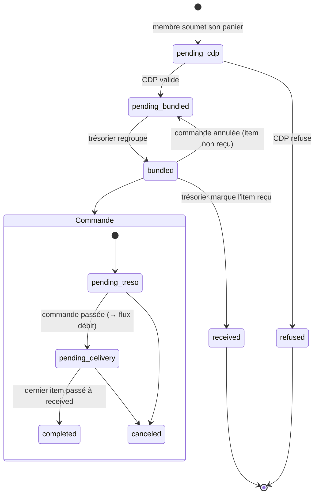

# Cahier des charges - Refonte des plateformes de commande et de trésorerie

## Conventions de lecture

Les exigences sont identifiées par un code stable pour permettre le suivi et la traçabilité :

- `CMD-*` : plateforme de commande
- `TRESO-*` : plateforme de trésorerie
- `TRANS-*` : exigences transverses (sécurité, performance, ergonomie, données)

Chaque exigence porte une priorité **MoSCoW** :

- **M** (Must) : indispensable à la première version utilisable à la rentrée
- **S** (Should) : important, à intégrer dès que possible après le socle
- **C** (Could) : confort, si le temps le permet
- **W** (Won't now) : noté pour plus tard, hors périmètre de la v1

Les blocs marqués **[Proposition]** ne sont pas des demandes issues des CR mais des choix de conception que je propose
pour combler les zones grises. Ils sont à arbitrer.

---

## 1. Contexte et objectifs

### 1.1 Contexte

L'association dispose aujourd'hui de deux outils internes : un site de commande de composants et un site de trésorerie.
Ces deux outils posent des problèmes de fiabilité (déconnexions, affichages aléatoires), de modèle (système de
permissions confus, données mal structurées) et d'ergonomie (statuts illisibles, historique peu exploitable). La
confiance dans l'outil actuel est insuffisante au point de ne pas vouloir y exposer la trésorerie tant que le socle
n'est pas sain.

L'activité se répartit sur deux campus, **Nantes** et **Paris**, ce qui impacte directement les adresses de livraison et
doit être visible sans ambiguïté.

### 1.2 Objectifs

1. Reconstruire un socle technique fiable (authentification, sessions, droits, persistance) en lequel on peut avoir
   confiance pour y porter la trésorerie.
2. Refondre le modèle de données autour du flux réel : les **membres ajoutent des items**, le **trésorier regroupe ces
   items en commandes**.
3. Rendre la gestion des commandes lisible et rapide (statuts clairs, distinction campus, budgets, historique utile).
4. Donner au trésorier un véritable outil de gestion financière (projets, partenariats, flux, justificatifs, documents,
   statistiques).
5. Repartir sur une base de données propre à la rentrée.

### 1.3 Périmètre

Deux plateformes (ou deux espaces d'une même application) partageant un socle commun (authentification, utilisateurs,
rôles, projets, partenaires) :

- **Plateforme de commande** : cycle de vie des items et des commandes, validation, livraison.
- **Plateforme de trésorerie** : projets, partenariats, flux financiers, justificatifs, documents et statistiques.

### 1.4 Échéance

Une première version saine et utilisable est attendue **pour la rentrée**, avec reprise sur base de données vierge.

---

## 2. Acteurs et rôles

| Acteur                   | Description             | Responsabilités principales                                                                     |
|--------------------------|-------------------------|-------------------------------------------------------------------------------------------------|
| **Membre**               | Membre d'un projet      | Propose des items (composants à acheter) rattachés à un projet                                  |
| **CDP** (chef de projet) | Responsable d'un projet | Revoit et valide les items proposés par les membres de son projet                               |
| **Trésorier**            | Gestion financière      | Regroupe les items validés en commandes, gère projets, partenariats, budgets et flux financiers |
| **Administrateur**       | Gestion de l'outil      | Gère les comptes, les rôles et la configuration                                                 |

> **[Tranché]** Le rôle n'est qu'un ensemble de permissions préconfiguré (voir §9). Un même utilisateur peut cumuler
> plusieurs casquettes (ex. membre d'un projet et CDP d'un autre). La notion de **campus** (Nantes / Paris) est par le
> projet auquel le membre est rattaché.

---

## 3. Glossaire métier

| Terme                  | Définition                                                                                                                                                                                                        |
|------------------------|-------------------------------------------------------------------------------------------------------------------------------------------------------------------------------------------------------------------|
| **Item**               | Un composant à acheter : nom, lien, prix unitaire TTC, quantité, projet, et un **état** couvrant tout son cycle de vie — de la revue CDP jusqu'à la réception (§7.1). Créé par un membre. (campus via fk projets) |
| **Commande**           | Un regroupement d'items, généralement passé auprès d'un même fournisseur/partenaire, avec des frais de port. Créée par le trésorier. (possibilité de pré-regroupement en fonction des liens fournisseur)          |
| **Projet**             | Une activité de l'association disposant d'un budget.                                                                                                                                                              |
| **Partenaire (parte)** | Un fournisseur/sponsor associé à un budget.                                                                                                                                                                       |
| **Flux financier**     | Une dépense (débit) ou une recette (crédit) de la trésorerie.                                                                                                                                                     |
| **Année scolaire**     | Période de référence servant à délimiter et archiver commandes et flux.                                                                                                                                           |
| **Frais de port**      | Coût d'expédition d'une commande, réparti entre les projets concernés.                                                                                                                                            |

---

## 4. État des lieux — problèmes constatés à corriger

Synthèse des dysfonctionnements relevés dans les CR. Ils constituent le point de départ des exigences des sections 5 à 10.

1. Les commandes ne s'affichent pas systématiquement (affichage non fiable).
2. Déconnexion pendant le traitement d'une commande, le tableau disparaît (gestion des tokens / sessions, cause non
   identifiée).
3. Déconnexions fréquentes en usage normal (gestion des tokens).
4. Système de permissions confus : mélange rôles / permissions, manque de confiance.
5. Impossible de modifier prix, quantités, noms et liens d'une commande.
6. Impossible de modifier une commande déjà passée.
7. Le drawer de modification s'ouvre en plusieurs exemplaires (il faut le fermer plusieurs fois), et les boutons de
   modification ne s'affichent pas.
8. À la validation, on ne peut pas modifier le prix de chaque composant un par un (unité ou total).
9. Tri des commandes basé sur la date de dernière mise à jour, peu pertinent.
10. Statuts de commande incohérents et non uniformes entre tables, filtres et affichage.
11. Aucune distinction visible entre Nantes et Paris (risque d'erreur d'adresse de livraison).
12. Historique peu utile (qui a modifié, mais pas quoi).
13. Prix ambigu : on ne sait pas si le montant affiché est unitaire ou total.
14. Cache à repenser.
15. Réinitialisation involontaire des champs quand on retire le dernier item dans `order/new`.

---

## 5. Exigences fonctionnelles — Plateforme de commande

### 5.1 Gestion des items (membres)

| ID       | Exigence                                                                                                                                                                                                                                                                                              | Prio |
|----------|-------------------------------------------------------------------------------------------------------------------------------------------------------------------------------------------------------------------------------------------------------------------------------------------------------|------|
| CMD-F-01 | Un membre peut créer un item rattaché à un projet, avec : nom, lien, prix unitaire, quantité, tags (si plusieurs tags séléctionnés, demandé à choisir par article).                                                                                                                                   | M    |
| CMD-F-02 | Un membre peut modifier et supprimer ses items tant qu'ils ne sont pas rattachés à une commande passée et qu'ils n'ont pas été validé par le CDP.                                                                                                                                                     | M    |
| CMD-F-03 | Dans le formulaire de création/édition, le retrait du dernier item doit réinitialiser sa ligne.                                                                                                                                                                                                       | S    |
| CMD-F-09 | La saisie se fait via un **panier multi-lignes** : le membre choisit un projet, ajoute N lignes et soumet le tout en une fois. Le panier est un écran de saisie, **pas une entité** : chaque ligne est persistée comme un item indépendant, et la vue « mes items » liste des items, pas des paniers. | M    |
| CMD-F-0A | Persistance des paniers en brouillon (le membre quitte et retrouve sa saisie en cours).                                                                                                                                                                                                               | W    |
| CMD-F-04 | La sélection de plusieurs tags se fait facilement (cases à cocher / multi-sélection).                                                                                                                                                                                                                 | C    |
| CMD-F-05 | Un message recommande aux membres de passer en priorité par les partenaires de l'association.                                                                                                                                                                                                         | S    |
| CMD-F-06 | Un indicateur signale au membre, au moment de la saisie, un dépassement du budget du projet concerné.                                                                                                                                                                                                 | S    |
| CMD-F-07 | Lors des commandes, proposer des composants des sites partenaires ou potentiellement moins chères avec avertissements.                                                                                                                                                                                | W    |
| CMD-F-08 | Pouvoir lier des fichiers aux items (kicad, excel mouser, ...)                                                                                                                                                                                                                                        | C    |

### 5.2 Constitution des commandes (trésorier)

| ID       | Exigence                                                                                                                                                                                                                | Prio |
|----------|-------------------------------------------------------------------------------------------------------------------------------------------------------------------------------------------------------------------------|------|
| CMD-F-10 | Le trésorier regroupe des items (validés) en une commande, par sélection multiple (cases à cocher).                                                                                                                     | M    |
| CMD-F-11 | Une commande porte un ou plusieurs items pouvant relever de projets différents.                                                                                                                                         | M    |
| CMD-F-12 | Les frais de port d'une commande sont répartis entre les projets concernés selon une règle définie (voir §7.3).                                                                                                         | M    |
| CMD-F-13 | Le trésorier peut indiquer un délai de livraison estimé par article.                                                                                                                                                    | W    |
| CMD-F-14 | Une commande porte un **nom de fournisseur libre** (`supplier_name`) et, si ce fournisseur est référencé, une **liaison optionnelle vers un partenaire** (`partner_id`). Aucun référentiel n'est imposé pour commander. | M    |
| CMD-F-15 | Pré-regroupement automatique des items par fournisseur, déduit du domaine de leur lien.                                                                                                                                 | C    |

### 5.3 Cycle de vie et statuts

| ID       | Exigence                                                                                                                                                                                                                                                                                             | Prio |
|----------|------------------------------------------------------------------------------------------------------------------------------------------------------------------------------------------------------------------------------------------------------------------------------------------------------|------|
| CMD-F-20 | Les statuts sont un ensemble **fermé et unique**, identique dans les tables, les filtres et l'affichage détail.                                                                                                                                                                                      | M    |
| CMD-F-21 | Statuts d'**item** : **En revue par le CDP** (`pending_cdp`) → **Validé** (`pending_bundled`) → **Regroupé** (`bundled`) → **Reçu** (`received`), plus **Refusé** (`refused`). Statuts de **commande** : **En attente du trésorier** → **En attente de livraison** → **Terminée**, plus **Annulée**. | M    |
| CMD-F-22 | Chaque statut dispose d'un repère visuel (badge coloré et/ou emoji) dans toutes les tables.                                                                                                                                                                                                          | M    |
| CMD-F-23 | Les transitions de statut sont contrôlées par les permissions (voir §8 et §9).                                                                                                                                                                                                                       | M    |
| CMD-F-24 | Si une commande qui pendant plus d'un mois est "en attente de livraison", un mail est envoyé à la tréso avec un bouton pour valider en un clic.                                                                                                                                                      | C    |
| CMD-F-25 | Le trésorier peut marquer **item par item** sa réception, ce qui autorise les **réceptions partielles** : une commande peut contenir simultanément des items `bundled` et des items `received`.                                                                                                      | M    |
| CMD-F-26 | Une commande passe à **Terminée** lorsque **tous** ses items sont `received` ; tant qu'il en reste au moins un en `bundled`, elle demeure **En attente de livraison**.                                                                                                                               | M    |
| CMD-F-27 | Le détail d'une commande affiche l'avancement de la réception (ex. « 7 / 12 reçus »), et la liste des commandes le signale sur la ligne.                                                                                                                                                             | S    |
| CMD-F-28 | Le membre voit passer ses propres items à **Reçu** sans avoir à consulter la commande qui les porte.                                                                                                                                                                                                 | S    |

> **[Tranché]** La **revue du CDP porte sur les items**, pas sur la commande. Un item passe de _En revue par le CDP_ à
> _Validé_ avant de pouvoir être intégré à une commande ; la commande ne connaît que _En attente du trésorier → En attente
de livraison → Terminée / Annulée_.
>
> Il n'y a **qu'une seule validation**, celle du CDP. Le trésorier ne valide pas les items : c'est l'acte de
> regroupement qui fait passer l'item de _Validé_ à _Regroupé_. L'état intermédiaire `pending_treso` au niveau item est
> donc supprimé.
>
> **[Tranché]** La **réception se suit au niveau item**, pas au niveau commande. L'item porte donc un état terminal
> `received` après `bundled`. C'est ce qui rend les **réceptions partielles** représentables — cas fréquent quand un
> fournisseur expédie en plusieurs colis ou met un composant en rupture — et c'est aussi ce qui permet à un membre de
> savoir que *son* composant est arrivé sans dépendre de l'état global de la commande.
>
> Le statut de la commande devient dès lors **dérivé** de celui de ses items pour la transition finale (CMD-F-26) :
> `completed` n'est pas un statut que le trésorier pose à la main, c'est la conséquence du fait que plus aucun item n'est
> en attente. Les autres transitions de commande (`pending_treso → pending_delivery`, `canceled`) restent, elles, des
> actes explicites du trésorier.

### 5.4 Modification des commandes et des prix

| ID       | Exigence                                                                                                                                                                 | Prio |
|----------|--------------------------------------------------------------------------------------------------------------------------------------------------------------------------|------|
| CMD-F-30 | On peut modifier le **prix, la quantité, le nom et le lien** des items d'une commande.                                                                                   | M    |
| CMD-F-31 | Au moment de la validation, le prix de **chaque composant** est modifiable individuellement, en **prix unitaire ou total** (les deux restent cohérents automatiquement). | M    |
| CMD-F-32 | Une commande **déjà passée** reste modifiable (correction a posteriori), la modification étant tracée dans l'historique.                                                 | M    |
| CMD-F-33 | L'édition se fait via un formulaire **CRUD plein écran/dédié**, et non via le drawer latéral exigu actuel.                                                               | M    |
| CMD-F-34 | Le composant d'édition s'ouvre en **un seul exemplaire** et se ferme proprement (correction du bug de multi-ouverture).                                                  | M    |
| CMD-F-35 | Les boutons de modification s'affichent de manière fiable dans toutes les vues.                                                                                          | M    |
| CMD-F-36 | Possibilité d'édition inline pour le treso type notion pour les champs non sensibles                                                                                     | C    |

### 5.4bis Convention de prix

Répond au problème n° 13 (« prix ambigu : unitaire ou total ? »), qui n'était couvert par aucune exigence.

| ID       | Exigence                                                                                                                                         | Prio |
|----------|--------------------------------------------------------------------------------------------------------------------------------------------------|------|
| CMD-F-37 | Un **item** porte un **prix unitaire TTC** et une **quantité**. Le membre recopie le prix affiché sur le site marchand, sans conversion à faire. | M    |
| CMD-F-38 | Le total d'un item est **toujours calculé** (`quantité × prix unitaire TTC`) et jamais saisi directement en base.                                | M    |
| CMD-F-39 | Une **commande** et un **flux financier** portent un **montant TTC unique**, sans aucune décomposition.                                          | M    |
| CMD-F-3A | Tout montant affiché dans l'application est un montant TTC : budgets, budget consommé, frais de port, soldes, écarts, rapports.                  | M    |

> **[Tranché]** L'application est **intégralement en TTC**. Un montant est un montant : celui qui sort du compte
> bancaire. Il n'existe **qu'un seul montant par entité**, à aucun niveau il n'est décomposé — ni item, ni commande, ni
> flux, ni budget, ni rapport.
>
> Conséquence : la saisie membre est triviale (un seul prix, celui qu'il a sous les yeux), le trésorier n'a jamais de
> ventilation à saisir ni à vérifier, et le rapprochement avec le relevé bancaire est direct.
>
> Si un besoin comptable de décomposition apparaît un jour, il sera traité au moment de la génération du document
> concerné (§6.5), à partir du montant TTC — et non par un ajout de colonnes au modèle, ce qui réintroduirait l'ambiguïté
> que la présente section supprime.

### 5.5 Campus et adresses de livraison (Nantes / Paris)

| ID       | Exigence                                                                                                                                                                                       | Prio |
|----------|------------------------------------------------------------------------------------------------------------------------------------------------------------------------------------------------|------|
| CMD-F-40 | Le détail d'une commande distingue clairement si elle est destinée à Nantes ou à Paris (couleur, badge Ker Juliette).                                                                          | M    |
| CMD-F-41 | Le détail rappelle l'adresse de livraison correspondant au campus, pour éviter les erreurs.                                                                                                    | M    |
| CMD-F-42 | Pour la trésorerie, la distinction Nantes / Paris est rendue visible au moment de commander.                                                                                                   | M    |
| CMD-F-43 | À la création d'une commande, l'adresse de livraison se **choisit parmi les adresses existantes** — celle du campus concerné étant pré-sélectionnée — **ou se saisit comme nouvelle adresse**. | M    |
| CMD-F-44 | Une adresse saisie à cette occasion est conservée et devient réutilisable pour les commandes suivantes.                                                                                        | M    |
| CMD-F-45 | Une adresse déjà utilisée peut être retirée des choix proposés sans altérer les commandes passées qui la référencent.                                                                          | S    |

> **[Tranché]** Le **campus** (Nantes / Paris) et l' **adresse de livraison** sont deux notions distinctes. Le
> campus est un attribut du membre et du projet : il sert de repère visuel (badge, couleur) et détermine l'adresse
> proposée par défaut. L'adresse de livraison, elle, appartient à la commande : une commande nantaise peut légitimement
> partir ailleurs qu'à Ker Juliette (livraison chez un partenaire, chez un membre pour un colis encombrant). Traiter
> l'adresse comme un simple libellé dérivé du campus reproduirait le défaut n° 11 au lieu de le corriger.

### 5.6 Budgets et alertes

| ID       | Exigence                                                                                 | Prio |
|----------|------------------------------------------------------------------------------------------|------|
| CMD-F-50 | Un indicateur de dépassement de budget est affiché côté membre et côté trésorier.        | M    |
| CMD-F-51 | Le budget consommé par un projet tient compte de la quote-part des frais de port (§7.3). | S    |

### 5.7 Historique et traçabilité

| ID       | Exigence                                                                                                              | Prio |
|----------|-----------------------------------------------------------------------------------------------------------------------|------|
| CMD-F-60 | L'historique enregistre **qui** a modifié **quoi** (champ, ancienne valeur, nouvelle valeur), pas seulement l'auteur. | M    |
| CMD-F-61 | Les changements de statut sont historisés avec précision (statut précédent, nouveau statut, auteur, date).            | M    |
| CMD-F-62 | L'historique est présenté de façon **linéaire**, les informations supplémentaires apparaissant au survol.             | S    |

### 5.8 Recherche et partenaires

| ID       | Exigence                                                                                                | Prio |
|----------|---------------------------------------------------------------------------------------------------------|------|
| CMD-F-70 | Un moteur de recherche des commandes/items est disponible pour le trésorier et les membres.             | S    |
| CMD-F-71 | La recherche incite et facilite le passage par les sites partenaires (lien, suggestion).                | C    |
| CMD-F-72 | Recherche automatique / via API des composants chez les partenaires.                                    | W    |
| CMD-F-73 | Proposition automatique de composants équivalents moins chers chez des partenaires, avec avertissement. | W    |

### 5.9 Affichage, tri et ergonomie des listes

| ID       | Exigence                                                                                                            | Prio |
|----------|---------------------------------------------------------------------------------------------------------------------|------|
| CMD-F-80 | Tri des commandes par **date de validation par le CDP** (et non par date de dernière mise à jour).                  | M    |
| CMD-F-81 | Les commandes sont organisées par **année scolaire**, avec une délimitation claire dans la liste.                   | M    |
| CMD-F-82 | La trésorerie est organisée par **année fiscale**, avec une délimitation claire dans la liste.                      | M    |
| CMD-F-83 | La table des commandes retire les tags et la date de dernière mise à jour, et ajoute la **date de validation CDP**. | S    |
| CMD-F-84 | Les tags et informations secondaires migrent vers la description / le détail de la commande.                        | C    |
| CMD-F-85 | Système de notifications (changement de statut, livraison, etc.). Via bot ou webhook discord ou par mail (boring)   | W    |

---

## 6. Exigences fonctionnelles — Plateforme de trésorerie

### 6.1 Projets et budgets

| ID         | Exigence                                                                                                                                                                                                    | Prio |
|------------|-------------------------------------------------------------------------------------------------------------------------------------------------------------------------------------------------------------|------|
| TRESO-F-01 | Le trésorier peut ajouter, modifier et supprimer des projets.                                                                                                                                               | M    |
| TRESO-F-02 | Le trésorier peut définir et modifier le budget d'un projet, **par année scolaire** : le budget est une enveloppe annuelle, stockée par couple (projet, année scolaire) et non comme un attribut du projet. | M    |
| TRESO-F-03 | Un projet a un budget normal et un budget parte                                                                                                                                                             | W    |
| TRESO-F-04 | Le budget consommé d'un projet sur une année est calculé à partir des items regroupés et de la quote-part de frais de port (§7.2).                                                                          | M    |

### 6.2 Partenariats et budgets

| ID         | Exigence                                                                  | Prio |
|------------|---------------------------------------------------------------------------|------|
| TRESO-F-10 | Le trésorier peut ajouter, modifier et supprimer des partenariats.        | M    |
| TRESO-F-11 | Le trésorier peut définir et modifier le budget associé à un partenariat. | M    |

### 6.3 Flux financiers (dépenses / recettes)

| ID         | Exigence                                                                                                                                                                                                      | Prio |
|------------|---------------------------------------------------------------------------------------------------------------------------------------------------------------------------------------------------------------|------|
| TRESO-F-20 | Le trésorier peut ajouter, modifier et supprimer des dépenses (débits) et des recettes (crédits).                                                                                                             | M    |
| TRESO-F-21 | Un flux peut être rattaché à un projet et/ou à un partenariat.                                                                                                                                                | M    |
| TRESO-F-22 | Le passage d'une commande à **En attente de livraison** crée **automatiquement** un flux de type débit rattaché à cette commande (`order_id`), d'un montant égal au total des items majoré des frais de port. | M    |
| TRESO-F-23 | Un flux issu d'une commande reste modifiable et supprimable par le trésorier ; l'annulation de la commande propose la contrepassation du flux.                                                                | S    |
| TRESO-F-24 | Un flux issu d'une commande est ventilé sur les projets concernés selon `ORDER_PROJECT_SHARE` (§7.2), afin que budget consommé et solde se recoupent.                                                         | M    |

### 6.4 Justificatifs

| ID         | Exigence                                                                               | Prio |
|------------|----------------------------------------------------------------------------------------|------|
| TRESO-F-30 | Chaque flux financier peut recevoir une ou plusieurs preuves (PNG, JPEG, PDF).         | M    |
| TRESO-F-31 | Les justificatifs sont consultables directement depuis le site (visionneuse intégrée). | M    |
| TRESO-F-32 | Transformation de toutes les images en pdf.                                            | W    |
| TRESO-F-33 | Regroupement automatique de tous les documents en un pdf via API.                      | W    |

### 6.5 Documents générés

| ID         | Exigence                      | Prio |
|------------|-------------------------------|------|
| TRESO-F-40 | Génération de notes de frais. | S    |
| TRESO-F-41 | Génération de devis.          | S    |
| TRESO-F-42 | Génération de factures.       | S    |
| TRESO-F-43 | Génération de reçus fiscaux.  | S    |

### 6.6 Tableaux de bord et statistiques

| ID         | Exigence                                                                                    | Prio |
|------------|---------------------------------------------------------------------------------------------|------|
| TRESO-F-50 | Graphiques et statistiques utiles sur la trésorerie (s'inspirer de l'Excel « bilan Hugo »). | S    |
| TRESO-F-51 | Détermination du solde des comptes à un instant donné.                                      | M    |
| TRESO-F-52 | Calcul des crédits/débits entre deux dates.                                                 | M    |

### 6.7 Évolutions futures de la trésorerie

| ID         | Exigence                                                                           | Prio |
|------------|------------------------------------------------------------------------------------|------|
| TRESO-F-60 | Budget prévisionnel.                                                               | W    |
| TRESO-F-61 | Comparatif automatiques de documents bancaires avec les entrées/sorties de la bdd. | W    |
| TRESO-F-62 | Export de rapports trimestriels (Q1–Q4) et de rapports par projet.                 | M    |
| TRESO-F-63 | Suivi des cotisations depuis le site (éventuellement via bot Discord).             | W    |

---

## 7. Modèle de données (proposition de refonte)

### 7.1 États (enums)

- **Item** `state` : `pending_cdp` → `pending_bundled` → `bundled` → `received` (terminal), plus `refused` (terminal).
- **Commande** `state` : `pending_treso` → `pending_delivery` → `completed`, plus `canceled` (atteignable depuis les
  deux premiers).

`received` est posé item par item par le trésorier (CMD-F-25). Le passage de la commande à `completed` en découle et
n'est pas saisi directement (CMD-F-26) : il se calcule au moment où le dernier item de la commande bascule en
`received`. Prévoir ce calcul côté base (trigger ou fonction sur `ITEM`), et non côté interface, pour qu'aucun chemin
d'écriture ne puisse laisser une commande entièrement reçue affichée comme en attente.

L'annulation d'une commande renvoie ses items non reçus à `pending_bundled` (ils redeviennent regroupables dans une
autre commande) et laisse intacts ceux déjà `received`.

### 7.1bis Périodes de référence

Deux découpages **distincts** coexistent, et c'est volontaire :

| Période            | Borne                               | S'applique à                                   |
|--------------------|-------------------------------------|------------------------------------------------|
| **Année scolaire** | 1er septembre → 31 août             | items, commandes, budgets de projet            |
| **Année fiscale**  | exercice comptable de l'association | flux financiers, soldes, rapports trimestriels |

> **[Tranché]** L'exercice fiscal retenu est l'**année civile** (1er janvier → 31 décembre). 
>
> Conséquence assumée : un flux généré par une commande (TRESO-F-22) peut tomber dans un exercice fiscal différent de
> l'année scolaire de sa commande. Une commande de décembre 2026 appartient à l'année scolaire 2027 mais à l'exercice
> fiscal 2026. Les deux périodes sont donc stockées séparément et ne se déduisent pas l'une de l'autre.

### 7.2 Règle de répartition des frais de port

Les frais de port d'une commande sont répartis entre les projets représentés dans cette commande. L'entité
`ORDER_PROJECT_SHARE` matérialise la quote-part de chaque projet.

> **[Tranché]** « Division équitable » peut signifier :
>
> - **Répartition égale** : `frais_port / nombre_de_projets_distincts`.
> - **Répartition proportionnelle** : au poids financier de chaque projet dans la commande
    (`montant_items_du_projet / montant_total_commande`).
>
> Par défaut, c'est la **répartition proportionnelle** (plus juste quand les volumes diffèrent), avec la répartition
> égale comme variante possible. La quote-part calculée alimente le budget consommé du projet (CMD-F-51).

Le trésorier peut sélectionner quel type de répartition. Par défaut : Répartition égale.

---

## 8. Cycle de vie d'une commande

Revue CDP au niveau item, commande pilotée par le trésorier, une seule validation, réception suivie item par item
(§5.3).



Le lien entre les deux niveaux se lit ainsi : le trésorier n'agit que sur les items (`received`), et la transition
`pending_delivery → completed` de la commande en est la conséquence automatique lorsque plus aucun de ses items n'est en
`bundled`. Une commande dont 7 items sur 12 sont reçus reste `pending_delivery` — c'est la réception partielle.

---

## 9. Exigences non-fonctionnelles

### 9.1 Authentification et sessions

| ID          | Exigence                                                                                                                                                                                     | Prio |
|-------------|----------------------------------------------------------------------------------------------------------------------------------------------------------------------------------------------|------|
| TRANS-NF-01 | La session ne doit pas expirer pendant le traitement d'une commande ; pas de déconnexion intempestive. Revue complète de la gestion des tokens (durée de vie, rafraîchissement, expiration). | M    |
| TRANS-NF-02 | Une expiration de session ne doit jamais faire disparaître le contenu affiché sans message ni reprise propre.                                                                                | M    |

### 9.2 Fiabilité d'affichage

| ID          | Exigence                                                                                                 | Prio |
|-------------|----------------------------------------------------------------------------------------------------------|------|
| TRANS-NF-10 | Les commandes s'affichent de manière déterministe et systématique (correction de l'affichage aléatoire). | M    |
| TRANS-NF-11 | Le tableau de commandes reste cohérent après actions (validation, édition, changement de statut).        | M    |

### 9.3 Performance et cache

| ID          | Exigence                                                                                    | Prio |
|-------------|---------------------------------------------------------------------------------------------|------|
| TRANS-NF-20 | Repenser la stratégie de cache (invalidation claire, cohérence des données après écriture). | S    |

### 9.4 Données et archivagef

| ID          | Exigence                                                                                                                                           | Prio |
|-------------|----------------------------------------------------------------------------------------------------------------------------------------------------|------|
| TRANS-NF-30 | Démarrage sur une base de données neuve à la rentrée ; pas de reprise de l'ancienne BDD.                                                           | M    |
| TRANS-NF-31 | Délimitation et archivage par année scolaire (items, commandes, budgets de projet) — voir §7.1bis.                                                 | M    |
| TRANS-NF-32 | Délimitation et archivage par année fiscale (flux, soldes, rapports) — voir §7.1bis.                                                               | M    |
| TRANS-NF-33 | Les deux périodes sont **stockées explicitement** sur les entités concernées et ne sont jamais dérivées l'une de l'autre au moment de l'affichage. | M    |

### 9.5 Ergonomie et accessibilité

| ID          | Exigence                                                                               | Prio |
|-------------|----------------------------------------------------------------------------------------|------|
| TRANS-NF-40 | Repères visuels cohérents (badges/couleurs) pour les statuts dans toute l'application. | M    |
| TRANS-NF-41 | Lisibilité immédiate de la distinction Nantes / Paris.                                 | M    |
| TRANS-NF-42 | Préférer des formulaires CRUD lisibles aux drawers exigus.                             | S    |

---

## 10. Priorisation et jalons

### 10.0 Règles de séquencement

Quatre principes gouvernent le découpage ci-dessous.

1. **Moche mais fonctionnel.** Hors du jalon 2, aucune exigence d'ergonomie ne bloque une mise en service. L'UI est
   jetable et assumée comme telle ; on la remplace en J8/J9 une fois les usages observés.
2. **La base de données ne se découpe pas.** C'est la seule chose qui doit être propre dès le départ, et c'est aussi la
   seule qu'on ne peut pas refaire à moindre coût. Le schéma **complet** — commandes *et* trésorerie — est posé en une
   fois au jalon 2, y compris les tables dont l'interface n'arrivera que trois jalons plus tard.
3. **Ordre de valeur : membre → CDP → trésorier.** Le parcours membre est la priorité déclarée ; il est aussi celui qui
   touche le plus d'utilisateurs et supporte le mieux une UI rudimentaire.
4. **Pas de date couperet.** Chaque jalon est mis en service dès qu'il passe son critère de sortie. Deux points de
   bascule seulement : fin de J5 (les membres et le trésorier abandonnent l'ancien outil de commande) et fin de J6 (le
   trésorier abandonne son Excel).

### 10.1 Jalon 1 — Socle sain

Authentification/sessions fiables (TRANS-NF-01/02), refonte RBAC (TRANS-PERM-01/02), affichage déterministe
(TRANS-NF-10/10).

### 10.2 Jalon 2 — Schéma de données complet et définitif 🔒 **bloquant**

Le seul jalon où la qualité prime sur la vitesse. Aucune interface produite ici.

**Périmètre** — Modélisation intégrale de §7 : `PROJECT`, `PROJECT_BUDGET` (par année scolaire), `PARTNER`, `ADDRESS`,
`ITEM`, `ORDER`, `ORDER_PROJECT_SHARE`, `FLUX`, `PROOF`, plus les deux tables de périodes (§7.1bis). Enums d'états
définitifs (§7.1). Convention **full TTC** en dur dans le schéma : `unit_price_ttc` + `quantity` sur l'item,
`amount_ttc` seul sur commande et flux — un unique montant par entité, aucune colonne de décomposition
(CMD-F-37/38/39/3A). `supplier_name` + `partner_id` nullable sur la commande (CMD-F-14). Dérivation de `completed` par
trigger sur `ITEM` (CMD-F-26). RLS sur toutes les tables. **Journal d'audit générique** (trigger unique : table, ligne,
champ, ancienne valeur, nouvelle valeur, auteur, date) — la capture se fait ici, l'affichage attendra J8.

**Couvre** : TRANS-NF-30/31/32/33, CMD-F-37/38/39, CMD-F-26 (mécanique), TRESO-F-02 (structure), socle de CMD-F-60/61.

**Critère de sortie** — Les types TypeScript sont générés, les migrations rejouables sur base vierge, et un jeu de
données de test traverse le cycle complet item → commande → réception partielle → réception totale → flux en SQL pur,
sans interface. Le passage à `completed` doit s'observer sans qu'aucun `UPDATE` ne l'ait écrit explicitement.

### 10.3 Jalon 3 — Parcours membre

La priorité n° 1. Écrans volontairement bruts.

**Périmètre** — Panier multi-lignes → items persistés individuellement (CMD-F-09, CMD-F-01), édition/suppression tant
que non validé (CMD-F-02), réinitialisation de la dernière ligne (CMD-F-03), vue « mes items » avec badges couvrant
**les cinq états** (CMD-F-22, CMD-F-28, TRANS-NF-40), badge campus (CMD-F-40, TRANS-NF-41), indicateur de dépassement de
budget à la saisie (CMD-F-06, CMD-F-50), message d'incitation partenaires (CMD-F-05).

**Critère de sortie** — Un membre soumet une liste de composants sans explication préalable et sait en un coup d'œil où
en est chacun de ses items, jusqu'à la réception. Les badges sont posés dès ce jalon même si rien ne peut encore
atteindre `received` avant J5.

### 10.4 Jalon 4 — Revue CDP

Petit jalon, mais il débloque la file du trésorier.

**Périmètre** — File des items en attente pour les projets dont on est CDP, validation et refus unitaires ou en lot,
motif de refus, horodatage de la validation (nécessaire au tri CMD-F-80), transitions contrôlées par permissions
(CMD-F-23).

**Critère de sortie** — Un item validé apparaît immédiatement dans la file du trésorier ; un item refusé sort du circuit
avec un motif visible par son auteur.

### 10.5 Jalon 5 — Parcours trésorier : commandes 🚩 **1ʳᵉ mise en service**

**Périmètre** — Regroupement manuel par cases à cocher (CMD-F-10/11), items de projets différents dans une même
commande, fournisseur et partenaire optionnel (CMD-F-14), adresse de livraison choisie ou créée avec pré-sélection par
campus (CMD-F-43/44, CMD-F-41/42), frais de port et répartition sélectionnable — égale par défaut (CMD-F-12, §7.2),
édition plein écran des prix/quantités/noms/liens en unitaire **ou** total (CMD-F-30/31/33/34/35), commande déjà passée
restant modifiable (CMD-F-32), transitions de statut (CMD-F-20/21/23), **réception item par item et réceptions
partielles** (CMD-F-25/26/27), tri par date de validation CDP (CMD-F-80), regroupement par année scolaire (CMD-F-81),
colonnes de table revues (CMD-F-83), quote-part de port dans le budget consommé (CMD-F-51, TRESO-F-04).

**Critère de sortie** — Une commande réelle est passée de bout en bout depuis l'outil, sans recours à l'ancien site, **y
compris un colis arrivé en deux fois** : la commande reste en attente tant qu'il manque un composant, puis bascule seule
en Terminée.

### 10.6 Jalon 6 — Parcours trésorier : trésorerie minimale 🚩 **2ᵉ mise en service**

Complète le « parcours trésorier » prioritaire. Les tables existent depuis J2 ; ce jalon ne fait qu'ouvrir les écrans.

**Périmètre** — CRUD projets et budgets annuels (TRESO-F-01/02), CRUD partenariats et budgets (TRESO-F-10/11), CRUD flux
débit/crédit rattachables projet et/ou partenaire (TRESO-F-20/21), **génération automatique du flux au passage de
commande** avec ventilation par projet (TRESO-F-22/24), contrepassation à l'annulation (TRESO-F-23), justificatifs
PNG/JPEG/PDF avec visionneuse (TRESO-F-30/31), solde à un instant donné (TRESO-F-51), crédits/débits entre deux dates
(TRESO-F-52), découpage par année fiscale (CMD-F-82, TRANS-NF-32).

**Critère de sortie** — Le solde affiché par l'outil est égal au solde bancaire réel sur un mois test, et le trésorier
n'ouvre plus son Excel pour le suivi courant.

### 10.7 Jalon 7 — Trésorerie avancée

**Périmètre** — Rapports trimestriels et par projet (TRESO-F-62), graphiques et statistiques inspirés du bilan Hugo
(TRESO-F-50), documents générés : notes de frais, devis, factures, reçus fiscaux (TRESO-F-40 à 43).

### 10.8 Jalon 8 — Traçabilité et recherche

L'audit est capté depuis J2 ; ce jalon l'expose et le rend exploitable.

**Périmètre** — Historique qui/quoi/avant/après (CMD-F-60), historique des changements de statut (CMD-F-61),
présentation linéaire avec détail au survol (CMD-F-62), moteur de recherche commandes/items pour trésorier et membres
(CMD-F-70), stratégie de cache et invalidation (TRANS-NF-20).

### 10.9 Jalon 9 — Confort et automatisations

**Périmètre** — Pré-regroupement automatique par domaine de fournisseur (CMD-F-15), édition inline type Notion
(CMD-F-36, TRANS-NF-42), multi-sélection de tags (CMD-F-04), tags déplacés vers le détail (CMD-F-84), délai de livraison
estimé par article (CMD-F-13), fichiers liés aux items — KiCad, BOM Mouser (CMD-F-08), suggestions de composants
partenaires (CMD-F-07, CMD-F-71).

### 10.10 Hors périmètre — reste en **W**

Relances par mail sur commande dormante (CMD-F-24), notifications Discord/mail (CMD-F-85), brouillons de panier
persistants (CMD-F-0A), double budget normal/parte (TRESO-F-03), conversion d'images en PDF et fusion via API
(TRESO-F-32/33), budget prévisionnel (TRESO-F-60), rapprochement bancaire automatique (TRESO-F-61), suivi des
cotisations (TRESO-F-63), recherche et comparaison de composants via API partenaires (CMD-F-72/73).

### 10.11 Chemin critique

```
J2 schéma ──┬──> J3 membre ──> J4 CDP ──┬──> J5 commandes 🚩──> J6 trésorerie 🚩
            │                            │
            └────────────────────────────┘         puis  J7 ──> J8 ──> J9

J2 bloque tout. J3 et J4 peuvent avancer en parallèle une fois le schéma figé.
J5 exige J4 (il lui faut des items validés à regrouper).
J6 exige J5 (le flux automatique est déclenché par le passage de commande).
```
